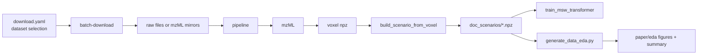

# FoundationMSMS

Clean ML project skeleton for LCMS foundation model work: data download, preprocessing, training, inference, and deployment.

## Workflow Schematic



## Preprocessing

Preprocessing code is organized as a Python module under `src/foundationmsms/preprocessing`.

Use the module entry point for data workflows:

```bash
python -m foundationmsms.preprocessing <command> [options]
```

Common examples:

```bash
python -m foundationmsms.preprocessing batch-download --config configs/datasets.yaml --base-dir data
python -m foundationmsms.preprocessing pipeline --dataset-dir data/raw/pride/PXD012353 --output-base data --workers 12
```

For full command reference, workflow details, and module structure, see:

- [src/foundationmsms/preprocessing/README.md](src/foundationmsms/preprocessing/README.md)

## End-To-End Experiment

Run the full workflow — download, preprocess, build scenario, train, build paper:

```bash
bash scripts/run_experiment.sh
```

Hyperparameters and paths are set via environment variables (see the script header). Datasets are read automatically from `configs/datasets.yaml`.

Build paper artifacts only (safe even when some models are not trained yet):

```bash
bash scripts/build_paper.sh
```

To keep all artifacts grouped under one run ID, set a fixed run name:

```bash
python -m foundationmsms.training.train_msw_transformer \
	--task joint \
	--scenario data/doc_scenarios/experiment_auto.npz \
	--run-name paper_run_v1 \
	--log-dir logs
```

Compute standard supervised baselines on a labeled scenario:

```bash
python -m foundationmsms.training.train_baselines \
	--scenario data/doc_scenarios/custom_scenario.npz \
	--models majority,naive_bayes,logreg,linear_svm,random_forest,xgboost,cnn \
	--out-dir logs/baselines
```

This writes per-fold and aggregated metrics as CSV/JSON so you can compare against the transformer.
## EDA Artifacts

Generate data-dimension EDA plots and summary tables:

```bash
python scripts/generate_data_eda.py \
	--scenario data/doc_scenarios/experiment_auto.npz \
	--voxel-root data/voxel \
	--out-dir experiments/paper/experiment_auto/eda
```

Outputs include:
- `files_per_dataset.png`
- `docs_per_dataset.png`
- `parents_per_file_boxplot.png`
- `voxels_per_file_boxplot.png`
- `tokens_per_doc_boxplot.png`
- `feature_counts_per_dataset.png` — unique feature IDs per dataset, stacked by exclusive vs shared
- `feature_overlap_heatmap.png` — pairwise |A ∩ B| feature overlap matrix
- `feature_jaccard_heatmap.png` — pairwise Jaccard similarity (|A ∩ B| / |A ∪ B|) heatmap
- `dataset_dimension_summary.csv`
- `dataset_dimension_summary.md`

