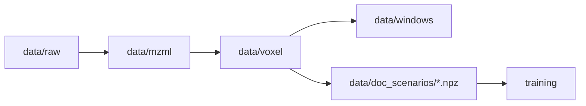

# Data Directory Structure

## Dataflow Schematic



## Organization

```
data/
├── raw/                    # Raw files from downloads
│   ├── pride/             # PRIDE datasets
│   │   ├── PXD012353/
│   │   │   └── *.raw
│   │   ├── PXD010595/
│   │   └── ...
│   └── massive/           # MassIVE datasets
│       ├── MSV000082648/
│       └── ...
│
├── mzml/                  # Converted mzML files
│   ├── pride/
│   │   ├── PXD012353/
│   │   │   └── *.mzML
│   │   └── ...
│   └── massive/
│       └── ...
│
├── voxel/                 # Voxelized data (sparse NPZ)
│   ├── pride/
│   │   ├── PXD012353/
│   │   │   └── *.npz
│   │   └── ...
│   └── massive/
│       └── ...
│
└── windows/               # Temporal windows (final training data)
    ├── pride/
    │   ├── PXD012353/
    │   │   └── *__t00000_00030.npz
    │   └── ...
    └── massive/
        └── ...
```

## Benefits

1. **Clear separation** by processing stage
2. **Source tracking** (pride vs massive) maintained throughout
3. **Easy cleanup** - delete entire stage directories (e.g., `rm -rf data/raw/`)
4. **Simple dataset selection** - all PXD012353 data organized under same name
5. **Training data discovery** - all windows in `data/windows/` regardless of source

## Example Workflow

```bash
# Download
python -m foundationmsms.preprocessing pride-download \
    --pxd PXD012353 \
    --out data/raw/pride/PXD012353

# Process (output-base is just "data", pipeline creates subdirs)
python -m foundationmsms.preprocessing pipeline \
    --dataset-dir data/raw/pride/PXD012353 \
    --output-base data \
    --cleanup-raw \
    --cleanup-mzml

# Result:
# - data/mzml/pride/PXD012353/*.mzML (if no cleanup)
# - data/voxel/pride/PXD012353/*.npz
# - data/windows/pride/PXD012353/*.npz
```

## Disk Space Management

With cleanup options:
```bash
# Keep everything (for debugging)
python -m foundationmsms.preprocessing pipeline \
    --dataset-dir data/raw/pride/PXD012353 \
    --output-base data

# Delete RAW after mzML conversion (save ~50%)
python -m foundationmsms.preprocessing pipeline \
    --dataset-dir data/raw/pride/PXD012353 \
    --output-base data \
    --cleanup-raw

# Delete both RAW and mzML (save ~80-90%, keep only voxels)
python -m foundationmsms.preprocessing pipeline \
    --dataset-dir data/raw/pride/PXD012353 \
    --output-base data \
    --cleanup-raw \
    --cleanup-mzml
```

## Training Data Access

All final training data:
```python
from pathlib import Path

# Load all windowed data for training
window_files = list(Path("data/windows").rglob("*.npz"))

# Filter by source if needed
pride_windows = list(Path("data/windows/pride").rglob("*.npz"))
massive_windows = list(Path("data/windows/massive").rglob("*.npz"))

# Filter by dataset
pxd012353_windows = list(Path("data/windows/pride/PXD012353").glob("*.npz"))
```

## Dimension Metrics You Should Track

- Voxel files per dataset
- Corrupt voxel files per dataset
- Parent bins per voxel file (p50/p90/p99)
- Nonzero voxels per file (distribution)
- Tokens per scenario document (p50/p90/p99)

Generate these with:

```bash
python scripts/generate_data_eda.py --scenario data/doc_scenarios/experiment_auto.npz --voxel-root data/voxel --out-dir experiments/paper/eda
```
