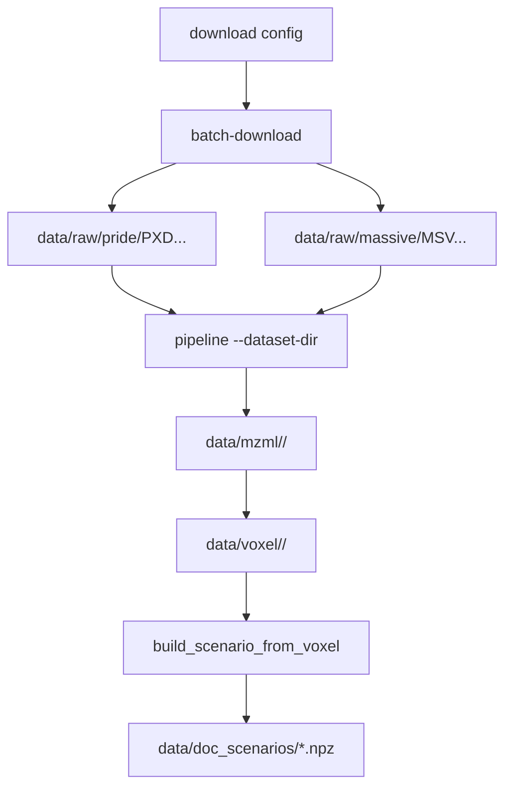

# Preprocessing Module

Data preprocessing utilities for Foundation LCMS: downloading, converting, and processing MS/MS data files.

## Overview

The preprocessing module handles the complete data pipeline:
1. **Download** raw or peak data from PRIDE/MassIVE
2. **Convert** RAW files to mzML format
3. **Voxelize** mzML files into sparse 3D tensors
4. **Window** voxel data for training
5. **Label** scenarios with dataset metadata

## Pipeline Schematic



```mermaid
flowchart LR
	X[voxel *.npz per file] -->|coords[:,0]| Y[parent bins per file]
	X -->|vals| Z[nonzero voxel count per file]
	H[data/doc_scenarios/*.npz] --> T[tokens_idx length per document]
	Y --> EDA[dataset_dimension_summary]
	Z --> EDA
	T --> EDA
```

## Usage

All preprocessing commands can be invoked using:

```bash
# Via Python module
python -m foundationmsms.preprocessing <command> [options]

# Via installed CLI command (if installed via pip install -e .)
lcms-download-voxelize [options]
lcms-add-labels [options]
lcms-build-scenario [options]
lcms-optimize-hparams [options]
lcms-voxelize-provenance [options]
```

## Commands

### download-and-voxelize (Default entry point)

Download, convert, and voxelize MS/MS data in a single pipeline:

```bash
python -m foundationmsms.preprocessing batch-download --config configs/datasets.yaml --base-dir data
python -m foundationmsms.preprocessing pipeline --dataset-dir data/raw/pride/PXD012353 --output-base data --workers 12
```

**Subcommands:**
- `batch-download` — Download multiple datasets from config
- `pride-download` — Download single PRIDE dataset
- `convert-raw` — Convert RAW → mzML
- `mzml-to-voxel` — Convert mzML → voxel npz
- `massive-download` — Download from MassIVE
- `massive-download-and-voxel` — Download and immediately voxelize
- `window` — Create temporal windows from voxels
- `pipeline` — Run complete pipeline (raw → mzml → voxel → windows)

### add-labels-to-scenario

Attach dataset labels to existing scenario files:

```bash
python -m foundationmsms.preprocessing add_labels_to_scenario --scenario data/doc_scenarios/docs_frag_only.npz --voxel-root data/voxel
```

### build-scenario-from-voxel

Build scenario files by collecting samples from specific datasets:

```bash
python -m foundationmsms.preprocessing build_scenario_from_voxel --voxel-root data/voxel --include PXD012353,PXD028735 --out data/doc_scenarios/custom.npz

# If some voxel files are corrupted from interrupted runs:
python -m foundationmsms.preprocessing build_scenario_from_voxel --voxel-root data/voxel --include PXD012353,PXD028735 --out data/doc_scenarios/custom.npz --delete-corrupt
```

### optimize-hparams

Run Optuna hyperparameter optimization:

```bash
python -m foundationmsms.preprocessing optimize_hparams --model msw_transformer --scenario data/doc_scenarios/docs_frag_only.npz --voxel-root data/voxel --n_trials 50
```

### voxelize-with-provenance

Advanced voxelization with metadata tracking:

```bash
python -m foundationmsms.preprocessing voxelize_with_provenance --mzml-dir data/mzml --voxel-dir data/voxel --workers 8
```

## Key Features

- **Parallel processing** — Use `--workers` or `--parallel` flags
- **Data format detection** — Automatically detects DIA/DDA acquisition modes
- **Checkpoint resumption** — Can resume interrupted pipelines
- **Progress tracking** — Real-time file count and size monitoring
- **Flexible configuration** — YAML-based dataset configuration

## Configuration Files

- `configs/datasets.yaml` — Define PRIDE/MassIVE datasets to download
- `configs/label_parsing.yaml` — Define label extraction rules

See `docs/` for detailed documentation.

## Shell Scripts

Utility shell scripts in `scripts/`:
- `batch_process_datasets.sh` — Batch download and process datasets
- `convert_raw_all.sh` — Convert all RAW files in directory

Run with:
```bash
bash scripts/batch_process_datasets.sh
bash scripts/convert_raw_all.sh
```

## EDA for Dataset Dimensions

Use the EDA script to inspect what each dataset contains (file counts, parent bins,
token-length distributions, and voxel density):

```bash
python scripts/generate_data_eda.py \
	--scenario data/doc_scenarios/experiment_auto.npz \
	--voxel-root data/voxel \
	--out-dir experiments/paper/eda
```

This writes figures and a tabular summary to `experiments/paper/eda/`.

## Module Structure

```
src/foundationmsms/preprocessing/
├── __init__.py                     # Module exports
├── __main__.py                     # CLI entry point
├── download_and_voxelize.py        # Core pipeline (renamed from build_foundation_lcms.py)
├── add_labels_to_scenario.py       # Label attachment
├── build_scenario_from_voxel.py    # Scenario building
├── optimize_hparams.py             # Hyperparameter optimization
└── voxelize_with_provenance.py     # Voxelization with metadata
```
